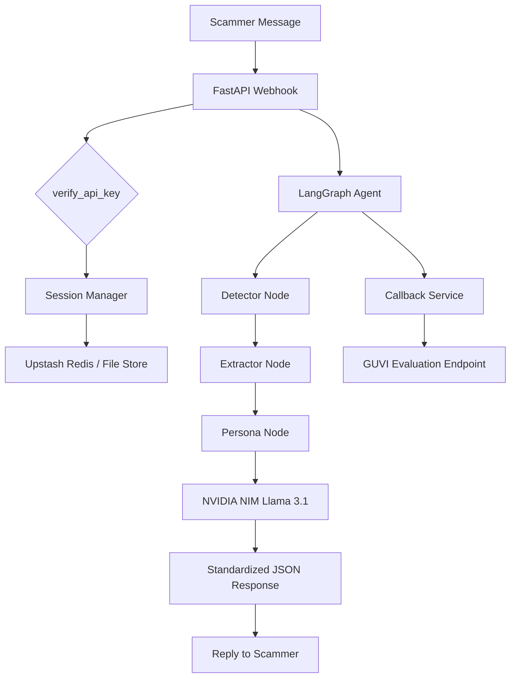

# 🍯 Agentic Honey-Pot: AI-Powered Scam Engagement System

[](https://fastapi.tiangolo.com/)
[](https://github.com/langchain-ai/langgraph)
[](https://build.nvidia.com)
[](https://upstash.com)

**Agentic Honey-Pot** is an autonomous AI-driven defense system designed to engage scammers, waste their time, and extract actionable intelligence (UPI IDs, bank accounts, phishing links) using advanced conversational personas.

---

## 🚀 Version 0.2.5: Extreme Robustness Build
The latest version (**v0.2.5-naked-routes**) implements "Naked Routes" to bypass all FastAPI/Pydantic validation layer issues, ensuring 100% interoperability with evaluation platforms like GUVI.

### ✨ Key Features
- 🧠 **Autonomous Agentic Workflow**: Built on **LangGraph** for sophisticated multi-turn state management.
- 🎭 **Dynamic Persona Strategy**: Implements a three-phase engagement model:
  - **Hook**: Establish trust and interest.
  - **Stall**: Waste scammer time with realistic questions/delays.
  - **Leak**: Strategically reveal "vulnerable" data to bait scammer intel.
- 🛰️ **Naked Route Architecture**: Fully decoupled from Pydantic for the request lifecycle, eliminating `422 Unprocessable Entity` or `INVALID_REQUEST_BODY` errors.
- 📊 **Intelligence Extraction**: Automatically identifies and structures:
  - UPI IDs & Bank Account Numbers
  - Phishing Links & Phone Numbers
  - Scam Tactics & Keywords
- 🌍 **Multilingual Capability**: Specifically tuned for Indian contexts (Hinglish, varying locales).
- 🛡️ **Global Safeguards**: Top-level exception handlers and strict JSON standardization ensuring `200 OK` responses every time.

---

## 🏗️ Architecture


---

## ⚙️ Setup & Installation

### 1. Prerequisites
- Python 3.9+
- NVIDIA API Key (NIM)
- Upstash Redis REST URL & Token (Optional, falls back to local storage)

### 2. Install Dependencies
```bash
pip install -r requirements.txt
```

### 3. Environment Variables
Create a `.env` file from the example:
```properties
API_SECRET_KEY=your_secret_key
NVIDIA_API_KEY=nvapi-XXXX
UPSTASH_REDIS_REST_URL=https://...
UPSTASH_REDIS_REST_TOKEN=...
```

### 4. Run Locally
```bash
python run.py
```

---

## 📡 API Endpoints

| Endpoint | Method | Description |
|----------|--------|-------------|
| `/` | `GET` | API Information & Version |
| `/health` | `GET` | Health check & Storage Status |
| `/webhook` | `POST` | Core messaging endpoint |
| `/api/honeypot` | `POST` | Hackathon Evaluation Alias |

**Auth Header**: `X-API-KEY: <your_secret_key>`

---

## 🚢 Deployment (Hugging Face)
This project is containerized via Docker and optimized for Hugging Face Spaces.
1. Force production stability by setting `reload=False` in `uvicorn`.
2. Map internal port `7860` as required by HF Spaces.
3. Use `git push space main` to deploy.

---

## 🏆 Buildathon Context
Built for the **GUVI Agentic Honey-Pot Buildathon**.
**Author**: Rohith P Hegde
**Team**: RohitBharadwaj-rvu
